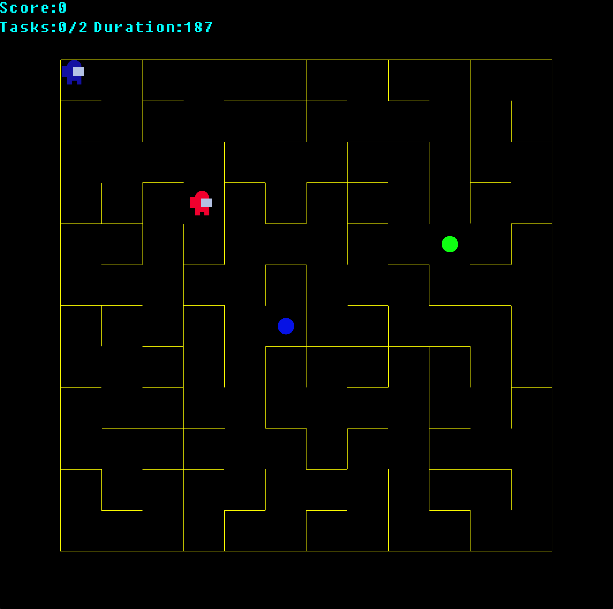

# Maze Runner
<i>Watch Out! Imposter Right behind!</i>

## How to run

1. Run `https://github.com/alapan-sau/Maze-Runner` to download the game.

2. Run `mkdir build ; cd build` inside the repository

3. Run `cmake ..`

4. Run `make`

5. Run `./Hello-World`


```shell
$ git clone https://github.com/alapan-sau/Maze-Runner
$ cd Maze-Runner
$ mkdir build; cd build
$ cmake ..
$ make
```



## Features

1. The main character has to reach the destination after completing a set of tasks running through a maze!

2. An imporster trying to kill the character, chasing it.

3. Score and Health is Diplayed at the top of screen.

4. There are both positive and negative rewarding power ups

5. The game is inspired from the popular mobile game Among Us

## Scoring Policy

The game starts with an initial `Health = 100` and `Score = 0`

- Collecting +Power Up: `Score+=20`
- Collecting -Power Up: `Score-=10`

## Game Controls

 <kbd>w</kbd>: Move Upwards<br>
 <kbd>s</kbd>: Move Downwards <br>
 <kbd>d</kbd>: Move Rightwards <br>
<kbd>a</kbd>: Move Leftward <br>

## Other Interesting Features

1. Implemented a Kruskal Algorithm to generate random Mazes at every new game

2. Used a Floyd Warshall Multi-source Shortest Path algorith for the Imposter to always pick the shortest path
